# yomail

A small, self-hosted **webhook catcher** (think webhook.site) running at `https://yo.manitra.fr`.

Create an endpoint, point any HTTP client at `https://yo.manitra.fr/<uuid>[/any/sub/path]`, and watch the requests arrive live at `/inbox/<uuid>`: method, path, query string, headers, client IP and a parsed, safely rendered body (JSON, form, multipart, HTML, XML, text).

An anonymous endpoint needs no account: its UUID is the only key, and anyone who knows it can read or clear the inbox. Requests are kept for a configurable number of days (10 by default) and then purged. A free account makes your endpoints **private** (only you can read them) and adds owner-only features: names, a configurable response, notes, replay, a longer retention and a higher cap.

> Built to run on **shared cPanel hosting** (Node 22 under Passenger on Apache, MySQL, no root), which shapes several design choices described below.

## Features

- **Capture anything**: every method (`GET`, `POST`, `PUT`, `PATCH`, `DELETE`, `OPTIONS`, `HEAD`), any sub-path, any content type. Bodies up to 512 KB (configurable); larger bodies get a `413` and are not stored.
- **Live inbox**: new requests are pushed over Socket.IO; the UI falls back to REST polling when the socket is down and shows a `live | polling | offline` badge.
- **Safe rendering**: HTML bodies are sanitized on read and displayed only inside a sandboxed `<iframe>` with a strict CSP; JSON is pretty-printed as text; binary bodies and uploaded files are never stored.
- **Bounded storage**: at most 500 requests per endpoint (oldest dropped on insert; 2,000 for endpoints owned by a member), automatic retention purge (10 days, 30 for owned endpoints), idle endpoints removed.
- **CORS-friendly**: capture URLs always answer with `Access-Control-Allow-Origin: *`, so browser-side code can call them directly.
- **Optional accounts** (free): sign up with a username, email and password, confirm by email, sign in. Endpoints created while signed in belong to the account, and a member can **claim** an endpoint that has no owner. Everything else keeps working anonymously.
- **Member features** (owner of the endpoint): **My endpoints** on the home page, a display **name**, a **configurable response** (status, content type, body, headers, delay up to 10 s; every custom response is sent with `Content-Security-Policy: sandbox` and `nosniff`), a free-text **note** per request and **replay** of a stored request to any public URL (SSRF-guarded). Any signed-in user also gets a client-side **filter** on the list and **Copy as cURL**. An owned endpoint is **private**: its details, inbox and live events are served to the owner only (`401` without a session, `403 NOT_OWNER` for another member); anyone can still send requests to it.

## Architecture at a glance

The three diagrams below are generated from the repository sources (see [docs/ARCHITECTURE.md](docs/ARCHITECTURE.md) for the full write-up and [docs/diagrams](docs/diagrams) for the diagram sources).

### System overview

<picture>
  <source media="(prefers-color-scheme: dark)" srcset="docs/diagrams/system-dark.svg">
  
</picture>

1. **Apache + Passenger** (cPanel) mount the NestJS app at the root of the subdomain. Passenger has no WebSocket support and may run several app processes, hence sticky sessions and the DB-polling design below.
2. **NestJS API** (`apps/api`): `CaptureController` stores incoming webhooks, the REST API under `/api` serves endpoints and requests, `LiveGateway` pushes Socket.IO events to one room per endpoint, `ChangeDetector` polls the database for rows captured by _other_ processes, `ServeStaticModule` serves the built SPA, `PurgeService` enforces retention.
3. **React SPA** (`apps/web`): home page (create / open / recent endpoints) and the inbox (request list + detail panel with viewers).
4. **MySQL** with three tables (`endpoints`, `requests`, `settings`) managed by TypeORM migrations.

### Capturing a webhook and delivering it live

<picture>
  <source media="(prefers-color-scheme: dark)" srcset="docs/diagrams/capture-live-dark.svg">
  
</picture>

- The UUID is validated and the endpoint existence is checked **before any body byte is read** (unknown endpoint → `404`).
- The capturing process pushes the event in memory; every other Passenger process learns about the row through a 2-second database poll. Both paths may deliver the same row, so the server remembers emitted ids for 15 s and the client dedupes by id.
- When the socket is unavailable the inbox polls the REST list every 5 s.

### Deployment to cPanel

<picture>
  <source media="(prefers-color-scheme: dark)" srcset="docs/diagrams/deploy-dark.svg">
  
</picture>

`scripts/deploy.sh` builds locally, uploads only the runtime file set over `tar | ssh`, merges `deploy/htaccess` with the Passenger block cPanel owns, installs production dependencies, runs migrations and restarts Passenger. The step-by-step server setup is in [docs/DEPLOY_CPANEL.md](docs/DEPLOY_CPANEL.md).

## Quick start (development)

Prerequisites: Node 22 (`.nvmrc`), npm, Docker (for the local MySQL).

```sh
npm install
cp .env.example .env            # defaults match docker-compose (MySQL on host port 3307)
docker compose up -d            # MySQL 8.4, db/user/password: yomail
npm run migration:run -w apps/api
npm run dev                     # API on http://localhost:3000, web on http://localhost:5173
```

Then exercise it:

```sh
curl -s -X POST http://localhost:3000/api/endpoints
# {"id":"<uuid>","url":"http://localhost:5173/<uuid>","created_at":"..."}

curl -i -X POST "http://localhost:5173/<uuid>/orders?x=1" \
  -H 'Content-Type: application/json' -d '{"hello":"world"}'
# HTTP/1.1 200 OK ... {"ok":true,"id":"<request id>"}

curl -s "http://localhost:3000/api/endpoints/<uuid>/requests?limit=10"
```

Open `http://localhost:5173/inbox/<uuid>` to see the request appear live. The Vite dev server proxies `/api` (including the Socket.IO path) and `/<uuid>...` capture paths to the API.

Other useful commands:

| Command                                                                               | What it does                                                           |
| ------------------------------------------------------------------------------------- | ---------------------------------------------------------------------- |
| `npm run build`                                                                       | Builds `packages/shared`, then `apps/api`, then `apps/web`             |
| `npm run lint` / `npm run format` / `npm run typecheck`                               | ESLint 9, Prettier, per-workspace `tsc`                                |
| `npm run migration:generate -w apps/api -- src/database/migrations/<Name>`            | Diff entities vs DB (then register the class in `migrations/index.ts`) |
| `npm run purge` / `npm run purge:dry-run -w apps/api`                                 | Retention purge (used by the cPanel cron)                              |
| `CPANEL_SSH=user@host npm run deploy [-- --dry-run\|--skip-build\|--no-migrate]`      | Build + upload + migrate + restart on cPanel                           |
| `apps/api/test/requests/send-all.sh`, `rest-flow.sh`, `apps/api/test/live-client.cjs` | Manual acceptance scripts (there is no automated test suite yet)       |
| `apps/api/test/auth/auth-flow.sh`, `apps/api/test/members/members-flow.sh`            | Accounts and member features walk-throughs (API outside production)    |
| `node apps/web/test/members-ui.cjs [BASE_URL]`                                        | Headless Chrome check of the member UI (API serving the built SPA)     |

The three account scripts read the confirmation links from the dev mail catcher, which is admin-only: each run creates a throwaway admin with `apps/api/dist/cli/user.js` (so build `apps/api` first; the CLI uses the same `.env` as the API) and deletes it at the end.

## HTTP API

Capture URLs live at the root of the host; the management API lives under `/api` (prefix configurable with `API_PREFIX`).

| Method   | Path                                                     | Description                                                                                                                                                                                                  |
| -------- | -------------------------------------------------------- | ------------------------------------------------------------------------------------------------------------------------------------------------------------------------------------------------------------ |
| `ANY`    | `/:uuid` and `/:uuid/*`                                  | Capture a request. `200 {ok, id}`, `404` unknown endpoint, `413` body too large. Always `Access-Control-Allow-Origin: *`. `HEAD` answers without a body.                                                     |
| `POST`   | `/api/endpoints`                                         | Create an endpoint (server-generated UUID v4)                                                                                                                                                                |
| `GET`    | `/api/endpoints/:id`                                     | Endpoint detail with `request_count`, `last_request_at`, `retention_days`, `max_requests`, `name`, `has_owner`, `owned`, `custom_response`, `response`. Owned endpoint: owner only (`401` / `403 NOT_OWNER`) |
| `DELETE` | `/api/endpoints/:id`                                     | Delete the endpoint and its requests (`204`). Owned endpoint: owner only                                                                                                                                     |
| `GET`    | `/api/endpoints/:id/requests?limit=50&before=<ISO date>` | Newest first, 50 per page (max 200), cursor on `received_at`; never includes bodies or headers. Owned endpoint: owner only                                                                                   |
| `GET`    | `/api/endpoints/:id/requests/:rid`                       | Full request, with `html_sanitized` computed on read and the owner's `note`. Owned endpoint: owner only                                                                                                      |
| `DELETE` | `/api/endpoints/:id/requests/:rid`                       | Delete one request (`204`). Owned endpoint: owner only                                                                                                                                                       |
| `DELETE` | `/api/endpoints/:id/requests`                            | Clear the inbox (`204`). Owned endpoint: owner only                                                                                                                                                          |
| `GET`    | `/api/health`                                            | `{status, db, retention_days, retention_days_members, max_body_bytes, max_requests_per_endpoint, max_requests_per_endpoint_members}`                                                                         |

Accounts (JSON bodies, session cookie `yomail_session`, errors as `{statusCode, code, message, fields?}`):

| Method   | Path                            | Description                                                                                                                                        |
| -------- | ------------------------------- | -------------------------------------------------------------------------------------------------------------------------------------------------- |
| `POST`   | `/api/auth/signup`              | `{username, email, password}` → `201 {ok}`; account created `DISABLED` and a confirmation email is sent. `409 EMAIL_TAKEN \| USERNAME_TAKEN`       |
| `POST`   | `/api/auth/confirm`             | `{token}` from the email link → account `ENABLED`, session opened, `200 UserProfile`. `400 TOKEN_INVALID` when used, expired or unknown            |
| `POST`   | `/api/auth/resend-confirmation` | `{email}` → always `200`                                                                                                                           |
| `POST`   | `/api/auth/login`               | `{identifier, password}` (email or username) → `200 UserProfile` + cookie. `401 INVALID_CREDENTIALS`, `403 ACCOUNT_DISABLED` (email not confirmed) |
| `POST`   | `/api/auth/logout`              | `204`, session revoked, cookie cleared                                                                                                             |
| `GET`    | `/api/auth/me`                  | `200 UserProfile` or `401 UNAUTHENTICATED`                                                                                                         |
| `POST`   | `/api/auth/forgot-password`     | `{email}` → always `200`; sends a reset link to `ENABLED` accounts                                                                                 |
| `POST`   | `/api/auth/reset-password`      | `{token, password}` → `204`, every session revoked                                                                                                 |
| `PATCH`  | `/api/account/password`         | `{current_password, new_password}` → `204`, other sessions revoked. `400 WRONG_PASSWORD`                                                           |
| `DELETE` | `/api/account`                  | `{password}` → `204`; the row becomes `DELETED` and anonymized, its endpoints stay reachable without owner                                         |

Sign-up, confirm, resend, login, forgot and reset are rate limited per IP (10 per 15 minutes by default, in-process). `POST /api/endpoints` records the caller as owner when a session cookie is present.

Member routes (session cookie required; `403 NOT_OWNER` when the endpoint belongs to someone else):

| Method  | Path                                      | Description                                                                                                                                                                                                                                     |
| ------- | ----------------------------------------- | ----------------------------------------------------------------------------------------------------------------------------------------------------------------------------------------------------------------------------------------------- |
| `GET`   | `/api/account/endpoints`                  | `{endpoints: [{id, url, name, created_at, last_request_at, request_count}]}`, most recently active first, 200 at most                                                                                                                           |
| `PATCH` | `/api/endpoints/:id`                      | Owner only. `{name?: string \| null, response?: ResponseConfig \| null}`; absent fields are unchanged, `null` clears. `name` is 1 to 80 characters. `response` = `{status, content_type, body, headers, delay_ms}` (see below)                  |
| `POST`  | `/api/endpoints/:id/claim`                | Take ownership of an endpoint that has none → `200 EndpointDetail`; already owned → `403 NOT_OWNER`                                                                                                                                             |
| `PATCH` | `/api/endpoints/:id/requests/:rid`        | Owner only. `{note: string \| null}`, at most 2000 characters → `200 RequestDetail`                                                                                                                                                             |
| `POST`  | `/api/endpoints/:id/requests/:rid/replay` | Owner only. `{target_url}` → `200 {status, headers, body, truncated, duration_ms, warning?}` whatever the target answers; `502 REPLAY_FAILED` when it cannot be reached in time; `400 VALIDATION` when the URL is refused. 30 per minute per IP |

A configured response is sent after the request is stored (so it is already in the inbox during `delay_ms`): `status` 100 to 599, `content_type`, a `body` up to 64 KB, up to 20 custom `headers` (framing, cookie, CORS and CSP header names are refused) and `delay_ms` up to 10,000. Capture errors (`404`, `413`) are never customised. Replay sends the stored method, path, query, headers (minus `Host`, framing and proxy headers) and body to `target_url`; only `http`/`https` to a public address are allowed, redirects are not followed, and the response body is cut at 64 KB. Admins are created only from the shell: `npm run user -w apps/api -- create-admin --username <u> --email <e>` (password from `YOMAIL_USER_PASSWORD` or a hidden prompt).

Socket.IO is served on `/api/socket.io`: emit `subscribe {endpointId}` (max 10 rooms per socket; the room of an owned endpoint is refused with `{ok:false, error:"UNAUTHENTICATED"|"NOT_OWNER"}` unless the handshake carries the owner's session cookie) and listen to `request:new`, `request:deleted`, `endpoint:cleared`, `endpoint:deleted`, `endpoint:claimed` (the endpoint just became private: re-check your access). DTOs and event maps are defined once in `packages/shared`.

## Configuration

All settings come from `apps/api/.env` (or the repo-root `.env` in development); see `.env.example`.

| Variable                                                              | Default                       | Purpose                                                                                     |
| --------------------------------------------------------------------- | ----------------------------- | ------------------------------------------------------------------------------------------- |
| `PORT`                                                                | `3000`                        | Listen port (ignored under Passenger)                                                       |
| `API_PREFIX`                                                          | `api`                         | Prefix of the management API and Socket.IO path                                             |
| `PUBLIC_BASE_URL`                                                     | `http://localhost:5173`       | Base of the capture URLs returned by the API                                                |
| `WEB_DIST_DIR`                                                        | _(empty)_                     | Built SPA directory served by Nest (`../web/dist` in production)                            |
| `TRUST_PROXY`                                                         | `0`                           | Set to `1` behind Apache so `req.ip` honours `X-Forwarded-For`                              |
| `CORS_ORIGIN`                                                         | _(unset)_                     | Allowed origin(s) for `/api` (dev: `http://localhost:5173`)                                 |
| `DB_HOST`, `DB_PORT`, `DB_USER`, `DB_PASSWORD`, `DB_NAME`             | `localhost`, `3306`, …        | MySQL connection                                                                            |
| `MAX_BODY_BYTES`                                                      | `524288`                      | Capture body limit (`413` above)                                                            |
| `MAX_REQUESTS_PER_ENDPOINT`                                           | `500`                         | Oldest rows dropped beyond this                                                             |
| `RETENTION_DAYS_DEFAULT`                                              | `10`                          | Used when the `settings` table has no `retention_days` row                                  |
| `MAX_REQUESTS_PER_ENDPOINT_MEMBERS`                                   | `2000`                        | Cap for endpoints owned by a member                                                         |
| `RETENTION_DAYS_MEMBERS_DEFAULT`                                      | `30`                          | Used when the `settings` table has no `retention_days_members` row                          |
| `REPLAY_TIMEOUT_MS`                                                   | `10000`                       | Total time allowed to a replayed request                                                    |
| `REPLAY_ALLOW_PRIVATE`                                                | `0`                           | `1` lets replay target loopback/private addresses (local tests only, refused in production) |
| `UNCONFIRMED_USER_TTL_DAYS`                                           | `7`                           | Accounts never confirmed are deleted after this many days                                   |
| `SESSION_TTL_DAYS`                                                    | `30`                          | Login session lifetime (cookie and `sessions` table)                                        |
| `CONFIRM_TOKEN_TTL_HOURS`, `RESET_TOKEN_TTL_MINUTES`                  | `48`, `60`                    | Validity of the confirmation and password reset links                                       |
| `AUTH_RATE_LIMIT`, `AUTH_RATE_WINDOW_MINUTES`                         | `10`, `15`                    | Per-IP limit on the sensitive auth routes (per process)                                     |
| `SMTP_HOST`, `SMTP_PORT`, `SMTP_SECURE`, `SMTP_USER`, `SMTP_PASSWORD` | `465`, `1`                    | Mail server, used in production only (SMTP_HOST required there); empty user = no auth       |
| `MAIL_FROM`                                                           | `yomail <no-reply@localhost>` | Sender of the account emails                                                                |

Retention is **computed, never stored**: changing `retention_days` (anonymous endpoints) or `retention_days_members` (owned endpoints) in the `settings` table applies immediately to every row.

Outside production (`NODE_ENV` other than `production`) no email is sent: every message the app would send is stored by the **dev mail catcher** (table `caught_mails`, last 200 messages) and readable at `http://localhost:<PORT>/devmailcatcher` (HTML list and detail, `messages.json?to=<email>` for scripts, `DELETE` to clear). The catcher is **admin-only** (`401` without a session, `403` for a standard member): sign in with an account created by `create-admin`, then use **Open the dev mail catcher** on the account page. The path is fixed and exists in **every environment, production included**, so other applications under development can use it as their mail sink: `POST /devmailcatcher/messages.json` with an admin session cookie and a JSON body `{ to, subject, from?, text?, html? }` (96 KB max, `text` or `html` required) stores the message and answers `201` with it (`links` holds every `http(s)` URL found). In production yomail's own emails still go out through SMTP and never appear there.

```sh
# other app -> dev mail catcher: sign in once as an admin, then push
curl -s -c jar -H 'Content-Type: application/json' -d '{"identifier":"admin","password":"..."}' https://yo.manitra.fr/api/auth/login
curl -s -b jar -H 'Content-Type: application/json' -d '{"to":"dev@example.test","subject":"Hi","html":"<p>Hello</p>"}' https://yo.manitra.fr/devmailcatcher/messages.json
```

## Repository layout

```
apps/api/          NestJS 10 + TypeORM + MySQL (capture, endpoints, requests, live, purge, static, users, auth, mail)
apps/web/          React 18 + Vite + Tailwind + React Router (+ socket.io-client)
packages/shared/   DTOs, Socket.IO event maps, endpoint id helpers (dual ESM/CJS build)
deploy/htaccess    Rules merged into the cPanel document root
scripts/deploy.sh  Build + tar-over-ssh deploy to cPanel
docs/              PLAN.md (product plan, French), ARCHITECTURE.md, DEPLOY_CPANEL.md, diagrams/
```

## Documentation

- [docs/ARCHITECTURE.md](docs/ARCHITECTURE.md): components, request lifecycle, real-time design, data model, security model, invariants.
- [docs/DEPLOY_CPANEL.md](docs/DEPLOY_CPANEL.md): server prerequisites, first deploy, acceptance checklist.
- [docs/PLAN.md](docs/PLAN.md) (French): scope, API contract and acceptance criteria that drove the implementation.
- [CLAUDE.md](CLAUDE.md): working notes and gotchas for contributors (and AI assistants).

## Scope and non-goals

Anonymous use stays deliberately minimal: capture, live inbox, clear, delete. Configurable responses, notes, replay, naming, filter and cURL export are reserved to signed-in users (plan phase 8). Still out of scope: server-side search, export of an inbox, geo-IP, general rate limiting on capture, an admin UI, automated tests and CI (plan phase 9). Manual acceptance scripts in `apps/api/test` (`requests/send-all.sh`, `requests/rest-flow.sh`, `auth/auth-flow.sh`, `members/members-flow.sh`, which read the email links from the dev mail catcher) and the headless Chrome script `apps/web/test/members-ui.cjs` replace a test suite for now.
